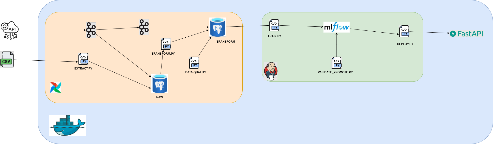

# Pipeline de Prévision et de Surveillance des Transactions frauduleuses

Prédire l’**Transactions frauduleuses**

| Couche                        | Technologie     | Fonctionnalité principale                                                 |
| ----------------------------- | --------------- | ------------------------------------------------------------------------- |
| **Données & Jobs**            | **Airflow 2.9** | Orchestration des tâches d’ingestion, transformation et chargement (ETL)  |
| **Streaming**                 | **Kafka**       | Traitement en temps réel et transport des données                         |
| **Stockage & Enregistrement** | **PostgreSQL**  | Stockage des données Airflow et de détection de fraude                    |
| **Surveillance & Qualité ML** | **Evidently**   | Détection de dérive de données et surveillance des performances du modèle |
| **Suivi des modèles ML**      | **MLflow**      | Suivi des expériences, versionnage et déploiement des modèles             |
| **Conteneurisation**          | **Docker**      | Isolation et portabilité des services dans des conteneurs                 |
| **CI/CD**                     | **Jenkins**     | Automatisation de l’entraînement, validation et déploiement du modèle     |

---

## 1 · Sources de données :

- **Les données de la qualité d'air** : [https://open-meteo.com/en/docs/air-quality-api](https://open-meteo.com/en/docs/air-quality-api)

---

## 2 · Démarrage rapide :

```bash
# Construire :et
docker compose build --no-cache

# Lancer l’ensemble des services :
docker compose up -d
```

## 3 · Accéder aux interfaces :

- **Airflow (admin / admin)** : [http://localhost:8080](http://localhost:8080)

- **MLflow** : [http://localhost:5000](http://localhost:5000)

- **Jenkins** : [http://localhost:8081](http://localhost:8081)

- **PostgreSQL** :

```bash
docker exec -it fraud_postgres psql -U postgres

# Pour voir les bases de données :
\l

```

- **FastAPI** :

```bash
curl -X GET http://localhost:8000/reload

curl -X GET http://localhost:8000/health

```

- **Kafka-CLI** :

```bash
kafka-console-consumer.sh \
  --bootstrap-server kafka:9092 \
  --topic nom_du_topic \
  --from-beginning
```

---

## 4 · Variables d’environnement clés :

Voir la liste complète dans `.env`.

---

## 5 · Schéma de la pipeline :



---

## 6 · DAGs Airflow par ordre chronologique :

| ID du DAG                     | Programmation              | Description                                                          |
| ----------------------------- | -------------------------- | -------------------------------------------------------------------- |
| `aqi_history_dag`             | `@once`                    | extraction + stockage et transformation pour les données historiques |
| `aqi_pipeline`                | `@hourly` ou personnalisée | extraction + stockage et transformation pour les nouvelles données   |
| `check_transform_quality_dag` | `@daily` ou personnalisée  | data_quality                                                         |
| `rapports_evidently_dag`      | `@daily` ou personnalisée  | détecter des dérives de données (drift)                              |

## 7 · Contenu de la pipeline :

1. Création des tables dans Postgresql.
2. Charger les données historiques dans la table aqi_raw.
3. Transformer les données historiques et les charger dans la table aqi_transform.
4. Extraire les données actuelles à partir de l'API.
5. Charger les données actuelles dans la table aqi_raw.
6. Transformer les données actuelles et les charger dans la table aqi_transform.
7. Vérifier la qualité des données dans la table 2 périodiquement.
8. Entraînement du modèle avec les données de la table aqi_transform.
9. Evaluer, valider, promouvoir le modèle dans la PROD.
10. Déployer le modèle en Prod, dans l'api FastAPI.

## 8 · Feuille de route

- À venir : ajout d’un tableau de bord pour la visualisation temps réel avec Grafana de la santé du système.

---

### Licence

MIT — utilisation, modification et partage libres. Contributions bienvenues !


